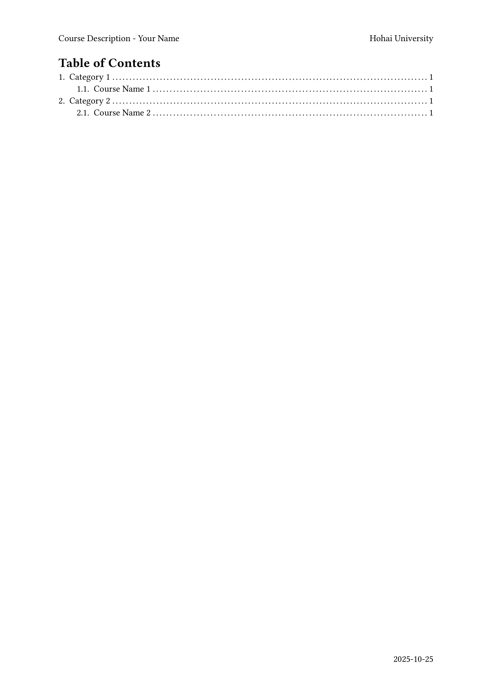
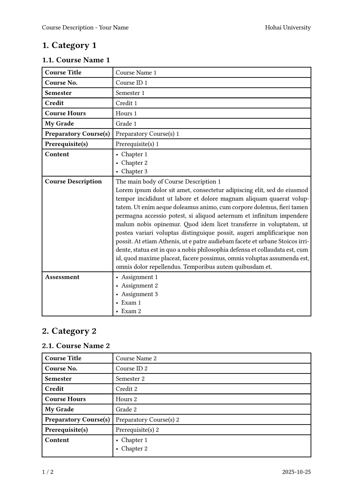
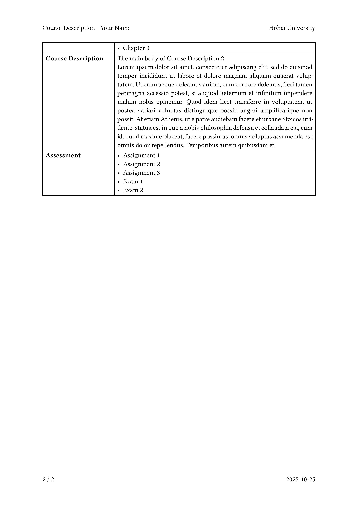

# 河海大学课程描述模板 / HHU Course Description Template

[English](#english) | [中文](#中文)

---

## 中文

# 河海大学课程描述模板

本仓库提供了一个 [Typst](https://typst.app/) 课程描述模板，旨在帮助生成清晰专业的课程摘要，适合河海大学学生申请国外大学时使用。

```diff
- 注意：
- 教务处对于专业英文名的要求是按照在读证明上官方的称呼（例如 Bachelor of Engineering in Computer Science and Technology），或者可以按照教务给的封面模板不写专业英文名；
- 对于除 Course Description 字段以外不包含在教务处给的课程描述素材包中的内容教务处不予对正文内容进行盖章，但允许给封面盖章。
```

## 预览

|  |  |
| ---------------------------------------------- | ---------------------------------------------- |
|  |  |

## 使用方法

在 `main.typ` 文件中，你只需要填写你的大学、专业、学院、姓名、学号以及每门课程的详细信息。模板将自动生成包含课程描述的 PDF 文件。

### 元数据

请在你的 `main.typ` 文件开头填写以下元数据：

```typst
#import "template.typ": template, course
#show: template.with(
  university: "The name of your University",
  major: "The name of your major",
  school: "The name of your School / Department",
  name: "Your Name",
  id: "Your Student ID",
  // The cover image settings
  cover: (
    logo_path: "logo_bupt2.png",
    logo_width: 100%,
    logo_with_university_name: true,
  ),
  // The watermark image settings as the background of the document
  watermark: (
    img_path: "logo_bupt_translucent.png",
    img_width: 160mm,
  ),
)
```

### 课程分类

使用 `= 课程类别名称` 来创建新的类别。例如，如果你想创建一个名为"专业课程"的类别，可以这样写：

```typst
= Major Courses
#course(...)
#course(...)
```

### 课程描述项目

`#course` 函数的参数都是命名参数。如果你不想填写某些参数，可以直接不使用它们。例如，如果你不需要"先修课程"，可以这样写：

```typst
#course(
  name: [Course Name 1],
  id: [Course ID 1],
  semester: [Semester 1],
  credit: [Credit 1],
  hours: [Hours 1],
  grade: [Grade 1],
  preparatory: [Preparatory Course(s) 1],
  content: [
    - Chapter 1
    - Chapter 2
    - Chapter 3
  ],
  description: [
    The main body of Course Description 1 \
    #lorem(100)
  ],
  assessment: [
    - Assignment 1
    - Assignment 2
    - Assignment 3
    - Exam 1
    - Exam 2
  ],
)
```

这样"先修课程"部分将不会在此课程描述表中显示。

## 致谢

本模板基于 [typst-course-description-template](https://github.com/dsyislearning/typst-course-description-template) 修改而成，感谢原作者的开源贡献。

---

## English

# HHU Course Description Template

This repository contains a template for creating Course Description using [Typst](https://typst.app/). It is designed to assist in generating clear and professional course summaries, especially useful for students at Hohai University who need to present course details in a standardized and visually appealing format when applying to universities.

```diff
- Note:
- The Academic Affairs Office requires the English name of the major to follow the official designation on the enrollment certificate (e.g., Bachelor of Engineering in Water Resources and Hydropower Engineering), or you may choose not to include the major's English name following the cover template provided by the Academic Affairs Office;
- For content other than the Course Description field that is not included in the course description material package provided by the Academic Affairs Office, the office will not stamp the main content but will allow stamping on the cover page.
```

## Preview

|  |  |
| ---------------------------------------------- | ---------------------------------------------- |
|  |  |

## Usage

In the `main.typ` file, you just need to fill in the information of your university, major, school, name, student ID, and the details of each course. The template will automatically generate a PDF file with the course descriptions.

### Metadata

Please begin your `main.typ` file with the following metadata:

```typst
#import "template.typ": template, course
#show: template.with(
  university: "The name of your University",
  major: "The name of your major",
  school: "The name of your School / Department",
  name: "Your Name",
  id: "Your Student ID",
  // The cover image settings
  cover: (
    logo_path: "logo_bupt2.png",
    logo_width: 100%,
    logo_with_university_name: true,
  ),
  // The watermark image settings as the background of the document
  watermark: (
    img_path: "logo_bupt_translucent.png",
    img_width: 160mm,
  ),
)
```

### Course Categories

Just use `= Course Category Name` to create a new category. For example, if you want to create a category named 'Major Courses', you can write:

```typst
= Major Courses
#course(...)
#course(...)
```

### Course Description Items

The `#course` function's parameters are all named parameters. If you don't want to fill in some of the parameters, you can just don't use them. For example, if you don't need 'Pre-requisites', you can just write:

```typst
#course(
  name: [Course Name 1],
  id: [Course ID 1],
  semester: [Semester 1],
  credit: [Credit 1],
  hours: [Hours 1],
  grade: [Grade 1],
  preparatory: [Preparatory Course(s) 1],
  content: [
    - Chapter 1
    - Chapter 2
    - Chapter 3
  ],
  description: [
    The main body of Course Description 1 \
    #lorem(100)
  ],
  assessment: [
    - Assignment 1
    - Assignment 2
    - Assignment 3
    - Exam 1
    - Exam 2
  ],
)
```

and the 'Pre-requisites' part will not be shown in this course description table.

## Acknowledgments

This template is adapted from [typst-course-description-template](https://github.com/dsyislearning/typst-course-description-template). Thanks to the original author for the open-source contribution.